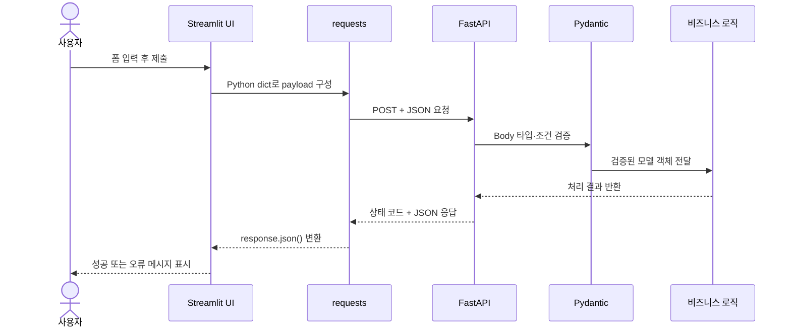
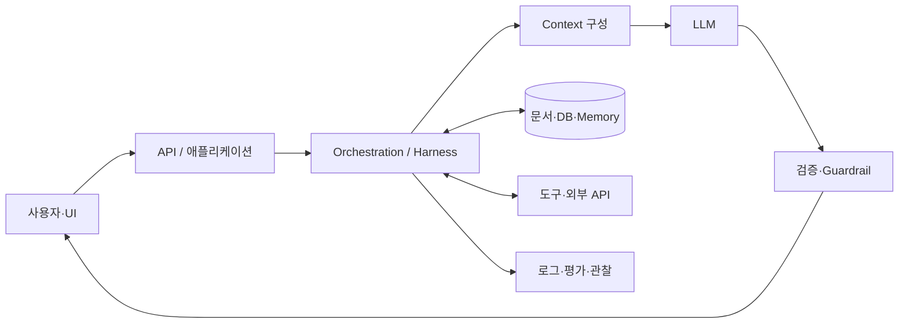

# 1주차 테스트 대비 핵심 정리

> 출제 성격: 실습 코드 작성보다 **개념, 용어의 차이, 데이터 흐름 이해** 중심

## 출제 범위 한눈에 보기

| 영역 | 반드시 이해할 내용 |
| --- | --- |
| Python 기본 문법 | `type()`, 조건문·반복문, `break` |
| 클래스·예외 처리 | 객체 초기화, `self`, `try-except-else-finally`, `raise` |
| NumPy | 배열의 차원·형태·크기·자료형, 인덱싱 |
| Matplotlib | 그래프 종류의 용도, 선·마커·색상 옵션 해석 |
| Pydantic | `BaseModel`, 타입 변환, 제약 조건, `ValidationError` |
| FastAPI | RESTful API, HTTP 메서드·상태 코드, 경로·쿼리·본문 |
| FastAPI 심화 | `HTTPException`, Enum, 선택 매개변수, 비동기, 자동 문서 |
| Streamlit 연동 | UI 입력부터 API 응답 출력까지 데이터 흐름, 세션 상태 |
| AI-Native | LLM을 중심으로 데이터·도구·평가를 연결하는 아키텍처 |
| Prompt·Context·Harness | 지시 작성, 입력 정보 구성, 모델 주변 실행 환경 설계 |

---

# Part 1. Python과 데이터 처리

## 1. `type()`과 자료형

`type(value)`는 값 또는 변수가 현재 어떤 자료형인지 반환함.

| 값 | 자료형 | 특징 |
| --- | --- | --- |
| `10` | `int` | 정수 |
| `3.14` | `float` | 실수 |
| `"hello"` | `str` | 문자열 |
| `True` | `bool` | 참·거짓 |
| `[1, 2]` | `list` | 순서 O, 변경 O |
| `(1, 2)` | `tuple` | 순서 O, 변경 X |
| `{1, 2}` | `set` | 중복 X |
| `{"name": "Kim"}` | `dict` | 키와 값의 쌍 |
| `None` | `NoneType` | 값이 없음을 나타냄 |

```python
age = 28
print(type(age))  # <class 'int'>
```

### 시험 포인트

- `type()`은 **Python 객체의 자료형**을 확인함.
- NumPy 배열의 원소 자료형은 보통 배열의 `dtype`으로 확인함.
- `"28"`은 숫자처럼 보여도 따옴표로 감쌌으므로 `str`임.
- `/` 연산 결과는 일반적으로 `float`, `//`는 몫을 반환함.

---

## 2. 제어문과 `break`

### 조건문

`if`는 조건이 참일 때, `elif`는 앞 조건이 거짓이고 자신의 조건이 참일 때, `else`는 모든 앞 조건이 거짓일 때 실행됨.

```python
if score >= 90:
    grade = "A"
elif score >= 80:
    grade = "B"
else:
    grade = "C"
```

조건은 위에서 아래로 검사하며 **처음 참이 된 분기 하나만 실행**함.

### 반복문

- `for`: 리스트, 문자열, `range()` 등의 항목을 순서대로 반복함.
- `while`: 조건이 참인 동안 반복함.
- `break`: 현재 실행 중인 **가장 가까운 반복문을 즉시 종료**함.
- `continue`: 현재 회차의 남은 코드를 건너뛰고 다음 반복으로 이동함.

```python
for fruit in ["apple", "banana", "cherry"]:
    if fruit == "banana":
        break
    print(fruit)
```

출력은 `apple` 하나뿐임. `banana`에서 반복문이 종료되므로 `banana`를 출력하는 줄과 이후 `cherry` 반복은 실행되지 않음.

### 반복문의 `else`

- 반복 조건이 자연스럽게 끝나면 `else`가 실행됨.
- `break`로 종료되면 `else`가 실행되지 않음.

### 시험 함정

- `break`는 `if`문을 종료하는 명령이 아니라 반복문을 종료하는 명령임.
- 중첩 반복문에서 `break`는 모든 반복문이 아니라 가장 안쪽 반복문 하나만 종료함.
- `return`은 함수 자체를 끝내지만 `break`는 반복문만 끝냄.

---

## 3. 클래스와 초기화

클래스는 객체를 만들기 위한 설계도이고, 객체는 클래스로부터 생성된 실제 인스턴스임.

```python
class Person:
    def __init__(self, name, age):
        self.name = name
        self.age = age

    def greet(self):
        return f"안녕하세요, {self.name}입니다."
```

| 용어 | 의미 |
| --- | --- |
| `Person` | 클래스 |
| `Person("Kim", 20)` | 객체 생성 |
| `__init__()` | 생성된 객체의 초기 상태를 설정하는 초기화 메서드 |
| `self` | 현재 메서드를 호출한 객체 자신 |
| `self.name` | 객체마다 보관되는 인스턴스 속성 |
| `greet()` | 객체가 수행할 동작인 인스턴스 메서드 |

### 시험 포인트

- `__init__()`은 객체가 만들어질 때 자동으로 호출되어 속성을 초기화함.
- `self.name = name`에서 오른쪽 `name`은 전달받은 매개변수이고 왼쪽 `self.name`은 객체에 저장되는 속성임.
- 서로 다른 객체는 각각 독립적인 `self.name`, `self.age` 값을 가질 수 있음.
- 엄밀히 말하면 객체 생성은 `__new__()`, 생성된 객체의 초기화는 `__init__()`이 담당함. 기초 시험에서는 `__init__()`을 초기화 메서드로 기억하면 됨.

---

## 4. 예외 처리

예외는 프로그램 실행 중 발생하는 오류 상황임. 예외 처리는 프로그램 전체가 갑자기 종료되는 것을 막고 상황에 맞는 처리를 하기 위해 사용함.

```python
try:
    result = 10 / number
except ZeroDivisionError:
    print("0으로 나눌 수 없습니다.")
except TypeError as error:
    print(error)
else:
    print(result)
finally:
    print("작업 종료")
```

| 구문 | 실행 시점 |
| --- | --- |
| `try` | 예외가 발생할 수 있는 코드 실행 |
| `except` | 지정한 예외가 발생했을 때 실행 |
| `else` | 예외가 발생하지 않았을 때 실행 |
| `finally` | 예외 발생 여부와 관계없이 마지막에 실행 |
| `raise` | 개발자가 의도적으로 예외를 발생시킴 |

### 실행 흐름

```text
예외 없음: try → else → finally
예외 발생: try 중단 → 일치하는 except → finally
```

### 자주 보는 예외

| 예외 | 발생 예시 |
| --- | --- |
| `TypeError` | 서로 맞지 않는 자료형끼리 연산 |
| `ValueError` | 자료형은 맞지만 값의 형식이 잘못됨 |
| `IndexError` | 리스트·배열의 범위를 벗어난 인덱스 |
| `KeyError` | 딕셔너리에 없는 키 접근 |
| `ZeroDivisionError` | 0으로 나눔 |
| `ConnectionError` | 서버 연결 실패 |
| `ValidationError` | Pydantic 검증 실패 |

### `raise`가 중요한 이유

`raise`는 잘못된 상태에서 이후 코드가 계속 실행되지 않게 하고, 오류의 원인을 호출한 쪽에 전달함.

```python
if age < 0:
    raise ValueError("나이는 0 이상이어야 합니다.")
```

### 시험 함정

- 모든 오류를 `except Exception:` 하나로 숨기면 원인 파악이 어려움.
- `finally`는 파일·DB 연결 정리처럼 성공과 실패 모두에서 필요한 작업에 적합함.
- FastAPI의 `HTTPException`은 `return`하지 않고 `raise`해야 요청 처리가 즉시 중단되고 오류 응답이 전달됨.

---

## 5. NumPy 배열의 특성값

NumPy의 `ndarray`는 같은 종류의 데이터를 효율적으로 저장하고 계산하는 다차원 배열임.

```python
arr = np.array([[1, 2, 3], [4, 5, 6]])
```

| 특성 | 예시 결과 | 의미 |
| --- | --- | --- |
| `arr.ndim` | `2` | 배열의 차원 수 |
| `arr.shape` | `(2, 3)` | 각 축의 길이: 2행 3열 |
| `arr.size` | `6` | 전체 원소 개수 |
| `arr.dtype` | 예: `int64` | 원소의 자료형 |
| `arr.itemsize` | 예: `8` | 원소 하나가 차지하는 바이트 수 |

### 차원과 인덱싱

| 배열 | 차원 | 접근 방식 |
| --- | --- | --- |
| `np.array(10)` | 0차원 | 스칼라 |
| `np.array([1, 2])` | 1차원 | `[열 위치]` |
| `np.array([[1, 2], [3, 4]])` | 2차원 | `[행, 열]` |
| 3차원 배열 | 3차원 | `[면, 행, 열]` |

인덱스는 `0`부터 시작하며 `-1`은 마지막 항목을 의미함.

```python
arr[0, 1]   # 첫 번째 행, 두 번째 열 → 2
arr[1, -1]  # 두 번째 행, 마지막 열 → 6
```

### Python 리스트와 NumPy 배열의 차이

- NumPy 배열은 일반적으로 같은 자료형의 값을 저장함.
- 배열 전체에 연산하는 벡터화가 가능하여 수치 계산에 유리함.
- 다차원 데이터의 구조를 `shape`로 명확하게 표현함.
- `arr * 2`는 각 원소를 2배 하지만 Python 리스트의 `list * 2`는 리스트를 반복 연결함.

---

## 6. Matplotlib 데이터 시각화

Matplotlib은 숫자 데이터를 사람이 패턴, 추세, 차이, 분포로 이해할 수 있도록 그래프로 표현함.

### 그래프 종류와 사용성

| 그래프 | 적합한 목적 | 예시 |
| --- | --- | --- |
| 선 그래프 `plot()` | 시간이나 순서에 따른 변화·추세 | 월별 매출 변화 |
| 막대 그래프 `bar()` | 범주별 크기 비교 | 상품별 판매량 |
| 산점도 `scatter()` | 두 변수의 관계·군집·이상치 | 공부 시간과 점수 |
| 히스토그램 `hist()` | 연속형 값의 분포 | 시험 점수 분포 |
| 원 그래프 `pie()` | 전체 중 비율 | 예산 구성비 |

그래프는 예쁘게 만드는 것보다 데이터의 목적에 맞는 모양을 선택하는 것이 중요함.

### 수업 코드 해석

```python
plt.plot(y_points, "*:c", ms=15, mec="m", mfc="m")
```

| 표현 | 의미 |
| --- | --- |
| `*` | 별 모양 Marker |
| `:` | 점선 Line style |
| `c` | Cyan 선 색상 |
| `ms=15` | Marker size |
| `mec="m"` | Marker edge color: Magenta |
| `mfc="m"` | Marker face color: Magenta |
| `plt.show()` | 완성한 그래프를 화면에 표시 |

### 좋은 그래프의 조건

- 제목과 축 이름으로 무엇을 나타내는지 알 수 있어야 함.
- 범례가 필요하면 계열의 의미를 명확히 표시함.
- 색상만으로 정보를 구분하지 않고 선 모양이나 Marker도 활용함.
- 축 범위를 과도하게 잘라 차이를 왜곡하지 않음.
- 비교에는 막대, 추세에는 선, 관계에는 산점도처럼 목적에 맞게 선택함.

---

# Part 2. Pydantic·FastAPI·Streamlit

## 7. Pydantic `BaseModel`과 데이터 검증

Pydantic은 외부에서 들어온 데이터를 Python 타입 힌트와 제약 조건에 맞게 **검증하고 변환**함.

```python
class User(BaseModel):
    name: str
    age: int = Field(ge=0, le=150)
```

### 검증 흐름

```text
외부 입력
  → BaseModel의 필드명·타입·제약 조건 확인
  → 변환 가능한 값은 타입 변환
  → 성공: 검증된 모델 객체
  → 실패: ValidationError
```

예를 들어 `age="28"`은 정수로 변환 가능하므로 `age=28`이 될 수 있지만, `age="스물여덟"`은 정수로 바꿀 수 없어 `ValidationError`가 발생함.

### 핵심 구성 요소

| 구성 요소 | 역할 |
| --- | --- |
| `BaseModel` | 데이터 모델의 기본 클래스 |
| 타입 힌트 | `name: str`, `age: int`처럼 예상 자료형 선언 |
| `Field()` | 값의 범위와 문자열 길이 등 추가 조건 설정 |
| `ValidationError` | 입력을 조건에 맞는 모델로 만들 수 없을 때 발생 |
| 중첩 모델 | 다른 `BaseModel`을 필드 타입으로 사용하여 내부 구조까지 검증 |
| `model_dump()` | 검증된 모델 객체를 Python 딕셔너리로 변환 |

### Optional에서 자주 틀리는 부분

```python
nickname: str | None = None
```

- `str | None`: 문자열 또는 `None`을 값으로 허용함.
- `= None`: 입력 자체를 생략했을 때 사용할 기본값임.
- `str | None`만 있고 기본값이 없으면 `None`은 허용하지만 필드 입력은 필수일 수 있음.

### Pydantic의 검증 대상

Pydantic은 원래 입력을 그대로 보장하는 것이 아니라, **검증과 변환을 마친 결과 모델이 선언한 타입과 조건을 만족함을 보장**하는 데 초점이 있음.

---

## 8. RESTful API와 HTTP 통신

### RESTful API

RESTful API는 URL을 자원(Resource) 중심으로 설계하고 HTTP 메서드로 그 자원에 수행할 동작을 표현함.

```text
좋은 예: GET /games/3
덜 RESTful한 예: GET /getGameById?id=3
```

### CRUD와 HTTP 메서드

| CRUD | HTTP 메서드 | 의미 | 예시 |
| --- | --- | --- | --- |
| Create | `POST` | 새 데이터 생성 | `POST /games/` |
| Read | `GET` | 데이터 조회 | `GET /games/1` |
| Update | `PUT` | 데이터 전체 수정·교체 | `PUT /games/1` |
| Update | `PATCH` | 데이터 일부 수정 | `PATCH /games/1` |
| Delete | `DELETE` | 데이터 삭제 | `DELETE /games/1` |

HTTP 요청은 보통 다음 요소로 구성됨.

- Method: `GET`, `POST` 등 수행할 동작
- URL/Path: 접근할 자원 위치
- Header: 콘텐츠 형식, 인증 정보 등 부가 정보
- Query string: 조회 조건이나 선택 옵션
- Body: 생성·수정할 JSON 데이터

HTTP 응답에는 상태 코드, Header, Body가 포함됨.

---

## 9. HTTP 상태 코드

상태 코드는 서버가 요청을 어떻게 처리했는지 알려주는 세 자리 숫자임.

| 범위 | 의미 | 대표 코드 |
| --- | --- | --- |
| `1xx` | 처리 정보 | `100 Continue` |
| `2xx` | 요청 성공 | `200`, `201`, `204` |
| `3xx` | 리다이렉션 | `301`, `304` |
| `4xx` | 클라이언트 요청 문제 | `400`, `401`, `403`, `404`, `422` |
| `5xx` | 서버 내부 문제 | `500`, `503` |

### 시험에 자주 나오는 코드

| 코드 | 이름 | 의미 |
| --- | --- | --- |
| `200 OK` | 성공 | 일반적인 조회·처리 성공 |
| `201 Created` | 생성됨 | `POST`로 자원 생성 성공 |
| `204 No Content` | 내용 없음 | 성공했지만 응답 Body가 없음 |
| `400 Bad Request` | 잘못된 요청 | 요청 형식이나 내용이 잘못됨 |
| `401 Unauthorized` | 인증 필요 | 로그인·인증 정보가 없거나 유효하지 않음 |
| `403 Forbidden` | 접근 금지 | 인증은 되었지만 권한이 없음 |
| `404 Not Found` | 찾을 수 없음 | 요청한 경로나 자원이 없음 |
| `422 Unprocessable Content` | 검증 불가 | 형식은 읽었지만 입력값 검증에 실패함 |
| `500 Internal Server Error` | 서버 오류 | 서버 코드에서 예상하지 못한 오류 발생 |

### 꼭 구분하기

- `401`: **누구인지 인증되지 않음**
- `403`: 누구인지는 알지만 **권한이 없음**
- `404`: 요청한 **자원이 없음**
- `422`: Pydantic 모델의 타입·조건 등 **데이터 검증 실패**

FastAPI에서 정상 응답 코드는 데코레이터에 지정할 수 있음.

```python
@app.post("/games/", status_code=201)
```

오류 응답은 다음과 같이 예외로 발생시킴.

```python
raise HTTPException(status_code=404, detail="게임을 찾을 수 없습니다.")
```

---

## 10. FastAPI 기본과 심화 기능

### 요청 값의 위치를 구분하는 기준

| 종류 | 선언 예시 | 요청 예시 |
| --- | --- | --- |
| 경로 매개변수 | `item_id: int`와 `/{item_id}` | `/items/3` |
| 쿼리 매개변수 | `q: str | None = None` | `/items/3?q=book` |
| 요청 본문 | `game: Game` | JSON Body |

```python
@app.put("/games/{game_id}")
async def update_game(game_id: int, game: Game):
    ...
```

- `game_id`: URL에 포함된 경로 매개변수
- `game`: Pydantic 모델로 검증되는 요청 Body

### 심화 기능 핵심

#### 1. 타입 기반 자동 검증

경로, 쿼리, Body의 타입 힌트를 보고 값을 변환하고 검증함. 실패하면 오류 응답과 자동 문서에 검증 정보가 반영됨.

#### 2. 고정 경로와 동적 경로의 순서

`/users/me` 같은 고정 경로는 `/users/{user_id}`보다 먼저 선언해야 `me`가 일반 `user_id`로 처리되는 문제를 피할 수 있음.

#### 3. Enum

Enum을 경로 매개변수의 타입으로 사용하면 허용할 값을 제한하고 자동 문서에 선택지를 표시할 수 있음.

#### 4. 선택 매개변수

```python
q: str | None = None
```

문자열 또는 `None`을 허용하고 기본값이 있으므로 생략 가능함.

#### 5. `HTTPException`

`raise HTTPException(...)`은 현재 요청 처리를 중단하고 지정한 상태 코드와 `detail`을 클라이언트에 전달함.

#### 6. `def`와 `async def`

- `await`가 필요한 비동기 I/O를 사용할 때 `async def`를 사용함.
- 단순 함수는 `def`로 작성할 수 있음.
- `async def`라고 작성하는 것만으로 CPU 작업이 자동으로 빨라지는 것은 아님.

#### 7. 자동 API 문서

- Swagger UI: `/docs`
- 타입, 매개변수, Body 스키마, 상태 코드가 OpenAPI 문서에 반영됨.

---

## 11. Streamlit UI와 FastAPI 데이터 흐름

이 범위는 각 함수 이름보다 **데이터가 어느 방향으로 이동하고 어디서 검증되는지**를 이해하는 것이 중요함.



### 수업 코드의 흐름

```text
1. st.text_input / st.number_input으로 값 입력
2. st.form_submit_button을 눌러 제출
3. {"name": name, "age": age} 형태의 payload 생성
4. requests.post(url, json=payload)로 FastAPI에 HTTP 요청
5. FastAPI가 Pydantic 모델로 JSON Body 검증
6. 비즈니스 로직 실행
7. FastAPI가 상태 코드와 JSON 반환
8. Streamlit이 response.status_code 확인
9. 성공 시 response.json(), 실패 시 st.error() 호출
```

### 각 구성 요소의 책임

| 구성 요소 | 책임 |
| --- | --- |
| Streamlit | 사용자 입력, 화면 표시, 세션 상태 관리 |
| `requests` | HTTP 요청 전송과 응답 수신 |
| FastAPI | URL·메서드 연결, 요청 처리, 응답 반환 |
| Pydantic | 요청 Body의 타입과 조건 검증 |
| 상태 코드 | 처리 결과가 성공인지 오류인지 전달 |
| JSON | 프런트엔드와 백엔드가 교환하는 데이터 형식 |

### `st.form`과 `st.session_state`

- Streamlit은 사용자 상호작용 시 스크립트를 위에서부터 다시 실행하는 방식임.
- `st.form`은 여러 입력을 모아 Submit 시 한 번에 전달함.
- `st.session_state`는 rerun 사이에도 유지해야 할 채팅 기록이나 선택값을 저장함.
- 채팅 화면은 저장된 `messages`를 먼저 다시 그린 뒤 새 입력과 응답을 목록에 추가함.

### 오류 흐름도 이해하기

```text
HTTP 응답을 받음
  ├─ status_code == 200 → JSON 읽기 → st.success / st.write
  └─ 그 외             → 상태 코드와 함께 st.error

서버에 연결하지 못함
  └─ ConnectionError → 서버 실행 여부 안내
```

`response.status_code`는 HTTP 응답이 도착했을 때 서버 처리 결과를 나타냄. `ConnectionError`는 서버 응답 자체를 받지 못한 네트워크·연결 문제이므로 서로 다른 상황임.

---

# Part 3. AI-Native 애플리케이션

## 12. AI-Native 애플리케이션 아키텍처

AI-Native 애플리케이션은 LLM을 단순 부가 기능으로 호출하는 것을 넘어, 애플리케이션의 핵심 판단·생성 과정에 모델을 포함하고 데이터, 도구, 피드백 구조를 함께 설계한 시스템임.



### 전통 애플리케이션과의 차이

| 전통 애플리케이션 | AI-Native 애플리케이션 |
| --- | --- |
| 같은 입력에 정해진 로직 실행 | 모델 출력에 확률적 변동이 있음 |
| 규칙을 코드에 명시 | 일부 판단·생성을 모델에 위임 |
| 단위 테스트만으로 검증하기 쉬움 | 예시 데이터셋, 품질 평가, 사람 검토도 필요 |
| 입력과 DB 값 중심 | Prompt, Context, Memory, 도구 결과도 입력이 됨 |

### 핵심 원칙

- 모델 자체보다 **모델을 둘러싼 데이터와 제어 구조**까지 함께 설계함.
- 확률적 출력을 그대로 신뢰하지 않고 검증, 재시도, 안전한 실패를 둠.
- 최신 지식은 RAG, 행동은 도구 호출, 대화 연속성은 Memory로 보완함.
- 성능뿐 아니라 정확도, 비용, 지연 시간, 보안, 관찰 가능성을 관리함.

---

## 13. Prompt 설계

Prompt Engineering은 모델이 원하는 작업을 수행하도록 **지시사항을 명확하게 작성하고 구조화하는 것**임.

### 좋은 Prompt의 기본 요소

```text
[역할] 너는 초보자를 가르치는 Python 튜터다.
[작업] 다음 코드의 실행 흐름을 설명하라.
[입력] 사용자가 제공한 코드
[제약] 실행 결과를 추측하지 말고 줄 단위로 설명하라.
[출력 형식] 핵심 개념 3개와 최종 결과를 표로 작성하라.
```

### 설계 원칙

1. 수행할 작업을 구체적인 동사로 작성함.
2. 필요한 입력과 참고 자료를 명확히 구분함.
3. 답변 범위, 금지 사항, 실패 시 행동을 지정함.
4. 원하는 출력 형식이나 예시를 제공함.
5. 모호한 표현보다 평가 가능한 기준을 사용함.

### PromptTemplate의 의미

`{country}`와 같은 변수 자리를 가진 템플릿을 만들면 같은 지시 구조에 입력값만 바꾸어 재사용할 수 있음.

```text
"{country}의 수도는 어디인가요?"
```

- `input_variables`: 실행할 때 전달할 값
- `partial_variables`: 미리 고정하거나 함수로 계산해 넣을 값
- 외부 YAML 파일: Prompt와 코드를 분리하여 버전 관리하고 재사용할 수 있음

---

## 14. Context 구성

Context는 한 번의 모델 호출에서 모델이 참고할 수 있도록 제공되는 **전체 정보 상태**임.

Context에 포함될 수 있는 것:

- System 지시사항과 Prompt
- 현재 사용자 질문
- 이전 대화 기록
- RAG로 검색한 문서
- 도구·API 실행 결과
- 사용자 정보와 작업 상태
- 출력 형식과 정책

### Prompt와 Context의 차이

| Prompt | Context |
| --- | --- |
| 모델에게 무엇을 할지 지시 | 모델이 판단에 사용할 전체 정보 |
| 작업과 출력 형식 중심 | 지시, 문서, 기록, 도구 결과 등을 모두 포함 |
| 잘 쓰는 것이 목표 | 필요한 정보를 선택·정리·갱신하는 것이 목표 |

Context Window는 제한되어 있으므로 정보를 무조건 많이 넣는 것이 좋지 않음. 오래되거나 중복되거나 관련 없는 정보는 중요한 지시와 근거를 묻히게 함.

### 좋은 Context의 조건

- Relevant: 현재 질문과 관련 있음
- Correct: 신뢰할 수 있고 정확함
- Current: 필요한 경우 최신 정보임
- Sufficient: 답변에 필요한 근거가 충분함
- Compact: 중복과 불필요한 내용이 적음
- Authorized: 사용자가 접근할 권한이 있음

---

## 15. Harness Engineering

Harness는 모델이 실제 작업을 안정적으로 수행하도록 모델 주변에 구성한 **실행 환경과 제어 시스템**임. Harness Engineering은 단순히 Prompt 한 문장을 잘 쓰는 것을 넘어, 모델이 사용할 환경, 도구, 상태, 검증, 피드백 루프를 설계하는 일임.

### Harness의 구성 요소

| 요소 | 역할 |
| --- | --- |
| 작업 명세 | 목표와 완료 조건 정의 |
| Context 관리 | 필요한 정보 선택, 요약, 갱신 |
| Tool 연결 | DB, 검색, 파일, 외부 API 사용 |
| Memory·State | 이전 작업과 현재 진행 상태 유지 |
| 권한·보안 | 허용된 도구와 데이터 범위 제한 |
| 검증 | 스키마, 규칙, 테스트로 결과 확인 |
| Retry·Recovery | 실패 원인에 따라 재시도 또는 안전하게 중단 |
| Observability | Prompt, 도구 호출, 결과, 비용, 지연 기록 |
| Feedback loop | 검증 결과를 다음 행동에 반영 |

### Prompt, Context, Harness를 한 문장으로 구분

```text
Prompt  = 모델에게 무엇을 하라고 말할 것인가?
Context = 모델에게 무엇을 보여줄 것인가?
Harness = 모델이 어떤 환경과 규칙 안에서 일하게 할 것인가?
```

### 예시

고객 환불 Agent가 있을 때:

- Prompt: “환불 정책에 따라 요청을 검토하라.”
- Context: 고객 주문 정보, 환불 정책, 이전 상담 내역
- Harness: 주문 조회 도구, 환불 권한 제한, 금액 검증, 사람 승인, 실행 로그, 실패 재시도

모델이 똑똑해도 잘못된 도구에 무제한 접근하거나 결과 검증이 없다면 안정적인 서비스가 될 수 없음. 그래서 AI-Native 개발에서는 모델 선택만큼 Harness 설계가 중요함.

---

## 16. 세 개념의 관계

| 구분 | 중심 질문 | 실패 예시 |
| --- | --- | --- |
| Prompt Engineering | 어떻게 지시할까? | 작업이나 출력 형식이 모호함 |
| Context Engineering | 어떤 정보를 보여줄까? | 오래되거나 관련 없는 정보가 포함됨 |
| Harness Engineering | 어떻게 안정적으로 실행시킬까? | 도구 오사용, 검증·복구·기록 부족 |

```text
좋은 AI 애플리케이션
= 적절한 모델
+ 명확한 Prompt
+ 필요한 Context
+ 안전한 Harness
+ 지속적인 평가와 개선
```

---

# 시험 직전 확인 문제

## O/X 및 단답형

1. `break`는 현재 함수 전체를 종료한다.
2. 반복문이 `break` 없이 끝나면 반복문의 `else`가 실행될 수 있다.
3. `__init__()`의 `self`는 현재 생성된 객체를 가리킨다.
4. `finally`는 예외가 발생한 경우에만 실행된다.
5. `raise`는 개발자가 의도적으로 예외를 발생시킬 때 사용한다.
6. NumPy의 `ndim`은 배열의 전체 원소 개수이다.
7. 선 그래프는 시간에 따른 변화와 추세를 표현하기 좋다.
8. Pydantic은 변환 가능한 문자열 숫자를 정수로 변환할 수 있다.
9. `str | None`만 선언하면 항상 해당 필드를 생략할 수 있다.
10. RESTful API에서 `POST`는 일반적으로 데이터 생성에 사용한다.
11. HTTP `404`는 서버 내부 코드 오류를 뜻한다.
12. FastAPI의 `HTTPException`은 `return`보다 `raise`로 사용한다.
13. Streamlit의 `response.status_code`는 서버 연결 자체의 성공 여부만 의미한다.
14. Context는 Prompt보다 넓은 개념으로, 검색 문서와 대화 기록도 포함할 수 있다.
15. Harness Engineering은 Prompt 문장만 다듬는 작업이다.

## 정답

1. X — 가장 가까운 반복문을 종료함. 함수 종료는 `return`임.
2. O
3. O
4. X — 성공과 실패에 관계없이 실행됨.
5. O
6. X — `ndim`은 차원 수이고 전체 원소 수는 `size`임.
7. O
8. O — 변환할 수 없는 값이면 `ValidationError`가 발생함.
9. X — 생략 가능하게 하려면 일반적으로 `= None` 같은 기본값도 필요함.
10. O
11. X — 요청한 자원이 없음을 의미함. 서버 내부 오류는 대표적으로 `500`임.
12. O
13. X — HTTP 응답을 받은 후 서버의 처리 결과를 나타냄. 연결 실패는 `ConnectionError` 등으로 구분함.
14. O
15. X — 도구, 상태, 권한, 검증, 재시도, 로그를 포함한 모델 주변 시스템을 설계함.

---

# 최종 암기 카드

```text
type()      → Python 객체의 자료형
break       → 가장 가까운 반복문 즉시 종료
__init__    → 객체의 초기 상태 설정
try         → 예외 가능 코드
except      → 예외 처리
else        → 예외가 없을 때
finally     → 항상 마지막에
raise       → 예외를 직접 발생

ndim        → 차원 수
shape       → 각 축의 길이
size        → 전체 원소 수
dtype       → 원소 자료형

BaseModel   → 타입·조건에 맞는 데이터 모델
Field       → 범위·길이 등 추가 조건
ValidationError → Pydantic 검증 실패
model_dump  → 모델을 dict로 변환

GET         → 조회
POST        → 생성
PUT         → 전체 수정·교체
PATCH       → 일부 수정
DELETE      → 삭제

200         → 성공
201         → 생성 성공
204         → 성공, 응답 Body 없음
401         → 인증 필요
403         → 권한 없음
404         → 자원 없음
422         → 입력 검증 실패
500         → 서버 오류

Prompt      → 무엇을 하라고 말할까?
Context     → 무엇을 보여줄까?
Harness     → 어떤 환경과 규칙에서 일하게 할까?
```

---

## 참고 자료

- [Pydantic 공식 문서: Models](https://docs.pydantic.dev/latest/concepts/models/)
- [FastAPI 공식 문서: Response Status Code](https://fastapi.tiangolo.com/tutorial/response-status-code/)
- [FastAPI 공식 문서: Handling Errors](https://fastapi.tiangolo.com/tutorial/handling-errors/)
- [Streamlit 공식 문서: Using forms](https://docs.streamlit.io/develop/concepts/architecture/forms)
- [Anthropic: Effective context engineering for AI agents](https://www.anthropic.com/engineering/effective-context-engineering-for-ai-agents)
- [OpenAI: Harness engineering](https://openai.com/index/harness-engineering/)
