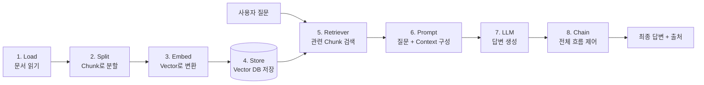
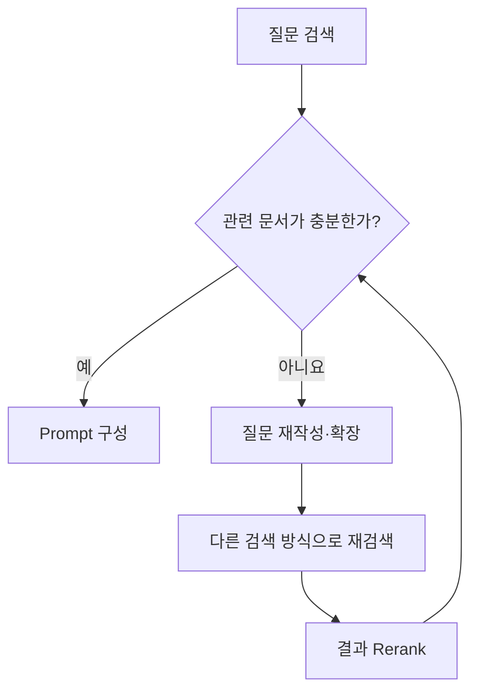

# RAG란 무엇인가?

RAG(Retrieval-Augmented Generation, 검색 증강 생성)는 **사용자의 질문과 관련된 자료를 먼저 검색하고, 검색한 자료를 문맥(Context)으로 LLM에 전달하여 답변을 생성하는 방식**임.

LLM이 학습할 때 기억한 내용만으로 답하면 오래되거나 부정확한 정보를 말할 수 있음. RAG는 사내 문서, 매뉴얼, PDF, 데이터베이스처럼 외부에 저장된 지식을 답변 시점에 찾아 제공함으로써 최신성, 근거, 통제 가능성을 높임.

> RAG의 핵심은 “LLM에게 모든 것을 외우게 하는 것”이 아니라, **필요한 자료를 잘 찾아서 답변할 때 참고하게 하는 것**임.

---

## 전체 구조

RAG는 크게 두 과정으로 나눌 수 있음.

| 과정 | 단계 | 실행 시점 |
| --- | --- | --- |
| 문서 준비(Indexing) | Load → Split → Embed → Store | 문서를 처음 등록하거나 갱신할 때 |
| 질문 답변(Query) | Retriever → Prompt → LLM → Chain | 사용자가 질문할 때마다 |



---

## 1. Load: 문서 읽어오기

Load는 RAG에서 사용할 원본 자료를 프로그램으로 읽어오는 단계임.

읽어올 수 있는 자료의 예시는 다음과 같음.

- PDF, Word, Excel, Markdown, 텍스트 파일
- 웹페이지와 사내 위키
- PostgreSQL 같은 데이터베이스
- 클라우드 저장소와 업무 시스템
- 이미지, 음성처럼 별도의 추출 과정이 필요한 자료

문서 본문만 읽는 것으로 끝내지 않고 출처를 추적할 수 있는 메타데이터도 함께 보관해야 함.

```python
document = {
    "text": "문서에서 추출한 본문",
    "metadata": {
        "source": "employee_manual.pdf",
        "page": 12,
        "updated_at": "2026-09-14",
        "department": "HR",
    },
}
```

### Load 단계에서 확인할 것

- 표, 제목, 문단이 올바른 순서로 추출되었는가?
- 스캔 PDF라면 OCR이 필요한가?
- 중복 문서와 오래된 문서를 어떻게 구분할 것인가?
- 답변에 표시할 파일명, 페이지, URL을 저장했는가?
- 사용 권한이 없는 문서가 섞이지 않았는가?

원본을 잘못 읽으면 뒤 단계가 아무리 좋아도 정확한 검색과 답변이 불가능함.

---

## 2. Split: 문맥을 보존하며 Chunk로 자르기

긴 문서 전체를 한 번에 임베딩하거나 프롬프트에 넣는 것은 비효율적임. Split은 문서를 검색하기 좋은 작은 단위로 나누는 단계이며, 나눈 결과 하나하나를 **Chunk(청크)**라고 함.

중요한 점은 글자 수에 맞춰 무조건 자르는 것이 아니라 **의미와 문맥이 가능한 한 끊기지 않도록 자르는 것**임.

### 좋은 분할 기준

1. 제목과 그 아래 설명을 가능한 한 같은 Chunk에 둠.
2. 문장 중간이나 표의 행 중간에서 자르지 않음.
3. 의미가 연결된 문단은 함께 유지함.
4. 앞뒤 Chunk가 일부 내용을 공유하도록 Overlap을 줄 수 있음.
5. Chunk마다 원본 문서와 페이지 등의 메타데이터를 유지함.

```text
[Chunk 1]
제목: 휴가 신청
내용: 휴가는 사용일 3일 전까지 신청한다.

[Chunk 2]
제목: 휴가 승인
내용: 팀장의 승인 후 휴가가 확정된다.
```

### Chunk 크기의 trade-off

| 구분 | 장점 | 단점 |
| --- | --- | --- |
| 너무 작은 Chunk | 세부 문장을 정확히 찾기 쉬움 | 문맥이 끊기고 의미가 부족할 수 있음 |
| 너무 큰 Chunk | 주변 문맥을 많이 보존함 | 불필요한 내용이 섞이고 검색 정밀도가 낮아질 수 있음 |

따라서 “항상 좋은 고정 크기”는 없음. 문서의 종류, 임베딩 모델의 입력 제한, 질문의 성격을 기준으로 여러 크기와 Overlap을 실험해야 함.

---

## 3. Embed: 의미를 Vector로 표현하기

Embed는 텍스트, 이미지 등의 의미적 특징을 **여러 개의 연속적인 실수값(`float`)으로 구성된 Vector**로 바꾸는 과정임. 이 변환을 수행하는 모델을 임베딩 모델이라고 함.

```text
"휴가 신청 방법" → [0.018, -0.227, 0.531, ..., 0.092]
```

한 단어나 문장을 특정 숫자 하나로 정의하는 것이 아니라, 많은 차원의 숫자가 함께 그 내용의 의미적 특징을 표현함. 같은 임베딩 모델에서 의미가 비슷한 텍스트는 벡터 공간에서도 비교적 가까운 위치에 놓이도록 학습되어 있음.

RAG에서는 다음 두 종류의 텍스트를 같은 임베딩 모델로 변환함.

1. 미리 저장할 문서 Chunk
2. 사용자가 입력한 질문

질문 벡터와 가까운 문서 벡터를 찾으면, 표현에 동일한 단어가 없어도 의미가 비슷한 문서를 검색할 수 있음.

### 꼭 구분할 개념: Embedding, Base Model, Fine-tuning

| 개념 | 의미 |
| --- | --- |
| Embedding | 입력을 의미 비교가 가능한 Vector로 변환한 결과 또는 그 과정 |
| Embedding Model | 입력을 Vector로 변환하도록 학습된 모델 |
| Base Model | 대규모 데이터로 사전 학습되어 다양한 작업의 기반이 되는 모델 |
| Fine-tuning | 특정 작업이나 출력 방식에 맞게 추가 학습하여 모델의 가중치를 조정하는 것 |

임베딩하여 DB에 저장하는 것은 모델을 학습시키는 Fine-tuning이 아님. 또한 문서를 RAG에 추가한다고 LLM 자체의 가중치가 바뀌는 것도 아님.

```text
RAG          : 외부 지식을 검색하여 입력에 추가함
Fine-tuning  : 모델의 행동이나 출력 특성을 바꾸도록 가중치를 학습함
```

챗봇이나 이미지 생성처럼 목적에 맞는 모델을 만들 때 Fine-tuning을 사용할 수 있지만, 자주 바뀌는 지식을 제공하고 출처를 보여주는 목적이라면 일반적으로 RAG가 더 적합함. 두 방식을 함께 사용할 수도 있음.

> 문서와 질문은 원칙적으로 같은 임베딩 모델과 버전을 사용해야 함. 임베딩 모델을 변경하면 벡터 공간도 달라지므로 기존 문서를 다시 임베딩해야 함.

---

## 4. Store: Vector DB에 영구 저장하기

Store는 문서 Chunk의 Vector와 원문, 메타데이터를 Vector DB에 저장하는 단계임. 프로그램을 종료해도 다시 사용할 수 있도록 영구 저장하며, 질문이 들어올 때마다 모든 문서를 다시 임베딩하지 않게 함.

보통 다음 데이터를 한 묶음으로 저장함.

```text
chunk_id + chunk_text + embedding + source + page + category + version
```

Vector DB는 일반적인 값의 일치 여부뿐 아니라 벡터 사이의 거리 또는 유사도를 계산하여 가까운 항목을 찾음. 대표적인 비교 방식으로 Cosine Similarity, Dot Product, Euclidean Distance 등이 있음.

### PostgreSQL이 유행인가?

PostgreSQL은 유행만으로 선택하는 신생 DB라기보다, 오랫동안 사용된 범용 오픈소스 관계형 DB임. `pgvector` 확장을 설치하면 기존 업무 데이터와 Vector를 같은 PostgreSQL 안에 저장하고, 정확 검색과 HNSW·IVFFlat 기반 근사 최근접 검색을 사용할 수 있음.

이미 PostgreSQL을 배우고 있거나 다음 조건에 해당하면 PostgreSQL + pgvector가 좋은 출발점임.

- 사용자, 상품, 권한 같은 관계형 데이터와 문서 Vector를 함께 관리해야 함.
- SQL, 트랜잭션, JOIN, 백업 체계를 그대로 활용하고 싶음.
- 처음부터 별도의 Vector DB 운영 요소를 늘리고 싶지 않음.

반면 Vector 검색이 서비스의 중심이고 대규모 Vector 검색 기능을 집중적으로 실험하려면 전용 Vector DB도 비교해볼 가치가 있음.

### DB 수업 외에 하나 더 사용한다면: Qdrant

PostgreSQL + pgvector와 다른 구조를 경험하기 위해 전용 Vector DB인 **Qdrant**를 추가 실습 대상으로 권장함. Qdrant는 Vector와 Payload(부가 정보)를 저장하고 유사도 검색, 필터링, 하이브리드 검색 등을 제공함. 로컬 Docker로 실행할 수 있어 학습용 비교 실습에도 적합함.

| 비교 항목 | PostgreSQL + pgvector | Qdrant |
| --- | --- | --- |
| 성격 | 관계형 DB에 Vector 검색 확장 | Vector 검색 전용 엔진 |
| 익숙한 도구 | SQL, JOIN, 트랜잭션 | Collection, Point, Payload |
| 추천 상황 | 기존 업무 DB와 RAG를 통합 | Vector 검색 기능을 집중적으로 학습 |
| 학습 목표 | 관계형 필터 + Vector 검색 | 전용 Vector DB의 검색·필터 구조 |

처음에는 두 DB의 성능 우열을 단정하기보다 **같은 문서와 질문을 넣고 결과, 설정 난이도, 검색 시간, 필터 방식**을 비교하는 것이 좋음.

---

## 5. Retriever: 관련 Chunk 검색하기

Retriever는 질문과 관련된 문서 Chunk를 저장소에서 꺼내는 구성 요소임. 이름 그대로 Retry(재시도)가 아니라 **Retrieve(찾아오다)**가 기본 의미임.

기본 검색 과정은 다음과 같음.

1. 사용자 질문을 Vector로 변환함.
2. DB의 문서 Vector와 유사도를 계산함.
3. 가장 가까운 Chunk를 상위 `k`개 가져옴.
4. 필요하면 권한, 날짜, 문서 종류 등의 메타데이터 조건으로 거름.
5. 검색 결과를 재정렬(Reranking)하여 더 관련성 높은 Chunk를 선택함.

```text
질문 → 질문 Embedding → Vector 검색 → Top-k Chunk → Filter/Rerank → Context
```

### “다시 시도하는 과정”은 언제 필요한가?

Retriever 자체는 검색기이지만, 첫 검색 결과가 부족할 때 재시도 로직을 추가할 수 있음. 이는 고급 RAG 또는 Agentic RAG의 일부임.



재시도 방법의 예:

- 애매한 질문을 더 구체적인 검색어로 재작성함.
- 여러 검색어로 질문을 확장함.
- Vector 검색과 키워드 검색을 결합함.
- 검색 범위나 메타데이터 필터를 조정함.
- 검색 결과를 Reranker로 다시 정렬함.
- 관련 자료가 없으면 억지로 답하지 않고 사용자에게 추가 정보를 요청함.

---

## 6. Prompt: 질문과 Context를 LLM에 전달하기

Prompt는 AI에게 무엇을 어떻게 수행할지 요청하는 입력임. RAG에서는 사용자의 질문뿐 아니라 Retriever가 찾은 자료를 **Context(문맥 또는 참고 자료)**로 함께 전달함.

```text
[지시사항]
아래 Context만 근거로 질문에 답하세요.
근거가 부족하면 모른다고 답하세요.
답변 끝에 출처를 표시하세요.

[Context]
- employee_manual.pdf, 12쪽: 휴가는 사용일 3일 전까지 신청한다.
- employee_manual.pdf, 13쪽: 팀장 승인 후 휴가가 확정된다.

[질문]
휴가는 언제까지 신청해야 하나요?
```

좋은 RAG Prompt에는 일반적으로 다음 내용이 필요함.

- 모델이 수행할 역할과 답변 형식
- 검색한 Context
- 사용자의 실제 질문
- Context에 답이 없을 때의 행동
- 인용 또는 출처 표시 규칙
- Context 안의 명령문을 지시로 따르지 않도록 하는 보안 규칙

Context가 많다고 항상 좋은 것은 아님. 관련 없는 Chunk가 많이 들어가면 핵심 근거를 놓치거나 잘못된 답을 만들 가능성이 커지고 토큰 비용도 증가함.

---

## 7. LLM: Context를 바탕으로 답변 생성하기

LLM은 Prompt에 포함된 지시사항, 질문, Context를 읽고 자연어 답변을 생성함.

여기서 LLM이 Vector DB를 자동으로 직접 검색하는 것은 아님. Chain 또는 애플리케이션 코드가 검색한 내용을 Prompt에 넣어 주어야 LLM이 참고할 수 있음.

LLM 단계의 책임은 다음과 같음.

- 검색된 여러 Chunk의 내용을 종합함.
- 질문에 맞는 형태로 설명함.
- 근거가 있는 내용과 없는 내용을 구분함.
- 가능한 경우 출처를 함께 제시함.

검색한 자료가 틀렸거나 관련이 없으면 LLM도 잘못 답할 수 있음. 따라서 좋은 모델 하나를 선택하는 것만으로 RAG의 정확성이 보장되지는 않음.

---

## 8. Chain: 모든 단계를 하나의 흐름으로 연결하기

Chain은 Load, Split, Embed, Store, Retrieve, Prompt, LLM 호출과 후처리를 실행 순서에 맞게 연결한 전체 작업 흐름임.

```python
# 개념을 설명하기 위한 의사 코드

def index_documents(files):
    documents = load(files)
    chunks = split(documents)
    vectors = embed(chunks)
    vector_store.upsert(chunks, vectors)


def answer(question):
    query_vector = embed_query(question)
    candidates = vector_store.search(query_vector, top_k=10)
    contexts = rerank(question, candidates)[:4]
    prompt = make_prompt(question, contexts)
    response = llm.generate(prompt)
    return add_sources(response, contexts)
```

실제 Chain에는 다음과 같은 분기와 제어도 들어갈 수 있음.

- 질문이 검색을 필요로 하는지 판단
- 사용자 권한에 맞는 문서만 검색
- 검색 품질이 낮으면 질문을 바꾸어 재검색
- 여러 Retriever 중 적절한 검색기 선택
- 민감정보 제거와 Prompt Injection 방어
- 답변 형식 검사와 출처 추가
- 처리 시간, 토큰, 검색 결과를 로그로 기록

### Chain과 Agent의 차이

| 구분 | Chain | Agent |
| --- | --- | --- |
| 실행 방식 | 개발자가 정한 순서대로 실행 | 상황에 따라 다음 행동이나 도구를 선택 |
| 예시 | 검색 → Prompt → 답변 | 검색 실패 판단 → 질문 재작성 → 다른 DB 검색 |
| 장점 | 예측과 테스트가 비교적 쉬움 | 복잡하고 동적인 문제를 처리 가능 |
| 주의점 | 복잡한 예외 대응이 제한적 | 비용, 지연, 무한 반복, 잘못된 도구 호출 관리 필요 |

---

## 왜 AI Agent 개발자가 필요한가?

AI의 답변은 확률적으로 생성되므로 항상 정확하거나 동일하지 않음. 그러나 “AI가 부정확하므로 개발자가 필요하다”에서 끝나는 것이 아니라, **각 단계의 실패를 측정하고 제어 가능한 시스템으로 만드는 역할**이 필요함.

RAG의 오류는 여러 위치에서 발생할 수 있음.

```text
문서를 잘못 읽음
  → 문맥이 끊기게 분할함
  → 부적절한 Embedding 사용
  → 검색 결과가 질문과 다름
  → Prompt에 불필요한 Context가 많음
  → LLM이 근거 없이 답함
```

AI Agent/RAG 개발자가 담당할 핵심 업무:

1. 문서 수집, 갱신, 삭제 정책을 설계함.
2. Chunk 크기와 임베딩 모델을 실험하고 선택함.
3. 검색 정확도와 답변 충실도를 평가함.
4. 권한 관리, 개인정보 보호, Prompt Injection 방어를 적용함.
5. 실패 시 재검색, 사용자 확인, 안전한 종료 절차를 만듦.
6. 응답 시간과 API·인프라 비용을 관리함.
7. 검색 근거와 실행 과정을 관찰할 수 있도록 로그를 남김.

즉, 개발자의 역할은 LLM의 답변을 무조건 신뢰하는 것이 아니라 **좋은 근거를 찾아 제공하고, 결과를 검증하며, 실패를 안전하게 처리하는 구조를 만드는 것**임.

---

## RAG와 Fine-tuning 선택 기준

| 목적 | RAG | Fine-tuning |
| --- | --- | --- |
| 자주 바뀌는 지식 반영 | 적합 | 재학습이 필요하므로 비효율적일 수 있음 |
| 사내 문서 기반 답변 | 적합 | 원문 근거 제공이 어려움 |
| 답변에 출처 표시 | 적합 | 모델의 기억만으로 출처 추적이 어려움 |
| 특정 말투·형식 학습 | Prompt와 함께 가능 | 특히 적합 |
| 반복 작업의 행동 패턴 학습 | 제한적 | 적합할 수 있음 |
| 모델 가중치 변경 | 없음 | 있음 |

둘은 경쟁 관계가 아님. 예를 들어 Fine-tuning으로 고객 상담 말투를 학습시키고, RAG로 최신 상품 정책을 검색하게 할 수 있음.

---

## 추천 실습 순서

1. Markdown 또는 PDF 문서 5~10개를 준비함.
2. 제목과 문단 기준으로 Chunk를 나눔.
3. 각 Chunk를 임베딩하고 원문·출처와 함께 저장함.
4. PostgreSQL + pgvector로 기본 유사도 검색을 구현함.
5. 같은 데이터를 Qdrant에도 저장하여 검색 결과를 비교함.
6. `top_k`, Chunk 크기, Overlap을 바꾸어 결과를 기록함.
7. Context에 없는 질문에는 “자료에서 확인할 수 없음”이라고 답하게 함.
8. 답변에 파일명과 페이지를 출처로 표시함.
9. 검색 실패 시 질문 재작성과 재검색을 추가함.

### 비교할 평가 항목

- 정답을 포함한 Chunk가 상위 검색 결과에 들어오는가?
- 답변이 Context의 근거와 일치하는가?
- 불필요한 Chunk가 너무 많이 검색되지 않는가?
- 출처가 원문 위치와 일치하는가?
- 문서가 갱신되거나 삭제되면 검색 결과에도 반영되는가?
- 응답 시간과 비용은 적절한가?
- 권한이 없는 문서가 노출되지 않는가?

---

## 한 문장씩 다시 정리

1. **Load**: 사용할 문서와 메타데이터를 읽어옴.
2. **Split**: 문맥을 최대한 보존하며 문서를 Chunk로 나눔.
3. **Embed**: Chunk와 질문의 의미를 비교 가능한 실수 Vector로 변환함.
4. **Store**: Vector, 원문, 메타데이터를 DB에 영구 저장함.
5. **Retriever**: 질문과 관련된 Chunk를 검색하고 필요하면 재검색·재정렬함.
6. **Prompt**: 질문과 검색된 Context, 답변 규칙을 LLM에 전달함.
7. **LLM**: 주어진 Context를 근거로 답변을 생성함.
8. **Chain**: 모든 단계와 실패 처리, 기록, 보안 규칙을 하나의 흐름으로 연결함.

---

## 참고 자료

- [RAG 원 논문: Retrieval-Augmented Generation for Knowledge-Intensive NLP Tasks](https://arxiv.org/abs/2005.11401)
- [PostgreSQL 공식 소개](https://www.postgresql.org/about/)
- [pgvector 공식 저장소](https://github.com/pgvector/pgvector)
- [Qdrant 공식 문서](https://qdrant.tech/documentation/)
- [Qdrant 로컬 Quickstart](https://qdrant.tech/documentation/quick-start/)
