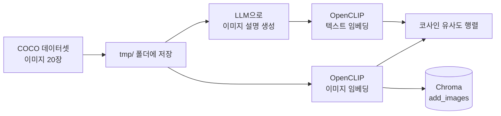

# RAG 4단계: Vector Store (Chroma)

RAG 과정 중 **Store** 단계. Split한 Chunk를 Embedding해서 Vector DB에 저장하고, 질문이 들어오면 유사한 Chunk를 검색하는 단계임.

| 실습 파일 | 내용 |
| --- | --- |
| `ch12/Ch11_00.ipynb` | Chroma 기본 사용법 (생성, 저장, 검색, 추가/삭제, Retriever) |
| `ch12/Ch11_01.ipynb` | 멀티모달 검색 (OpenCLIP으로 이미지-텍스트 임베딩) |

---

## 1. 문서 준비 (Load → Split)

```python
from langchain_community.document_loaders import TextLoader
from langchain_text_splitters import RecursiveCharacterTextSplitter

text_splitter = RecursiveCharacterTextSplitter(chunk_size=600, chunk_overlap=0)

loader1 = TextLoader("data/nlp-keywords.txt", encoding="utf-8")
loader2 = TextLoader("data/finance-keywords.txt", encoding="utf-8")

split_doc1 = loader1.load_and_split(text_splitter)
split_doc2 = loader2.load_and_split(text_splitter)
```

- `load_and_split(splitter)`: 로드와 분할을 한 번에 수행함.
- `TextLoader`는 각 Document의 `metadata["source"]`에 파일 경로를 자동으로 넣어줌 → 나중에 `filter`로 활용.

---

## 2. DB 생성

### 2-1. 메모리 DB

```python
from langchain_chroma import Chroma
from langchain_openai.embeddings import OpenAIEmbeddings

db = Chroma.from_documents(
    documents=split_doc1, embedding=OpenAIEmbeddings(), collection_name="my_db"
)
```

- `persist_directory`가 없으면 **메모리에만 저장**됨. 커널 재시작이나 셀 재실행 시 사라짐.

### 2-2. 디스크 저장 / 불러오기

```python
DB_PATH = "./chroma_db"

# 저장
persist_db = Chroma.from_documents(
    split_doc1, OpenAIEmbeddings(),
    persist_directory=DB_PATH, collection_name="my_db",
)

# 불러오기 (from_documents가 아니라 생성자 사용)
persist_db = Chroma(
    persist_directory=DB_PATH,
    embedding_function=OpenAIEmbeddings(),
    collection_name="my_db",
)
persist_db.get()
```

- 불러올 때 파라미터 이름이 `embedding`이 아니라 **`embedding_function`** 임.
- 저장할 때와 같은 `collection_name`, 같은 임베딩 모델을 써야 함.

### 2-3. 문자열 리스트로 생성

```python
db2 = Chroma.from_texts(
    ["안녕하세요. 정말 반갑습니다. ", "제 이름은 혜림입니다. "],
    embedding=OpenAIEmbeddings(),
)
```

---

## 3. 유사도 검색

```python
db.similarity_search("TF IDF에 대하여 알려줘")        # 기본 k=4
db.similarity_search("TF IDF에 대하여 알려줘", k=2)   # 상위 2개

# metadata 필터
db.similarity_search(
    "TF IDF에 대하여 알려줘", filter={"source": "data/nlp-keywords.txt"}, k=2
)
```

- `filter`는 metadata 값이 정확히 일치하는 문서만 대상으로 검색함.
- DB에 없는 source(예: `finance-keywords.txt`를 넣지 않은 DB)로 필터하면 빈 결과가 나옴.

---

## 4. 문서 추가 / 조회 / 삭제

| 메서드 | 용도 |
| --- | --- |
| `add_documents([Document(...)])` | Document 객체로 추가 |
| `add_texts(texts, metadatas, ids)` | 문자열로 추가 |
| `get(ids)` / `get(where={...})` | id 또는 metadata 조건으로 조회 |
| `delete(ids=[...])` | id로 삭제 |
| `reset_collection()` | 컬렉션 전체 초기화 |

```python
from langchain_core.documents import Document

db.add_documents([
    Document(
        page_content="안녕하세요! 이번엔 도큐먼트를 새로 추가해 볼게요",
        metadata={"source": "mydata.txt"},
        id="1",
    )
])

# 같은 id로 추가하면 덮어씀(upsert)
db.add_texts(
    ["이전에 추가한 Document를 덮어쓰겠습니다. ", "덮어쓴 결과는?"],
    metadatas=[{"source": "mydata.txt"}, {"source": "mydata.txt"}],
    ids=["1", "2"],
)

db.delete(ids=["1"])
db.get(where={"source": "mydata.txt"})
db.reset_collection()
```

> **id가 같으면 새로 추가되지 않고 기존 문서를 덮어씀.** 중복 적재를 막는 용도로 쓸 수 있지만, 의도치 않게 id를 겹치면 데이터가 사라진 것처럼 보임.

---

## 5. Retriever로 변환

Chain에 연결하려면 DB를 Retriever로 바꿔서 `invoke()`로 사용함.

```python
db = Chroma.from_documents(
    documents=split_doc1 + split_doc2,
    embedding=OpenAIEmbeddings(),
    collection_name="nlp",
)

# 기본: 유사도 상위 k개
retriever = db.as_retriever()
retriever.invoke("Word2Vec에 대하여 알려줘")

# 점수 기준 이상만
retriever = db.as_retriever(
    search_type="similarity_score_threshold",
    search_kwargs={"score_threshold": 0.8},
)

# 필터 + 개수 지정
retriever = db.as_retriever(
    search_kwargs={"filter": {"source": "data/finance-keywords.txt"}, "k": 2}
)
retriever.invoke("ESG에 대하여 알려줘")
```

| search_type | 동작 |
| --- | --- |
| `similarity` (기본) | 유사도 상위 k개 |
| `similarity_score_threshold` | 점수가 threshold 이상인 것만 |
| `mmr` | 유사도 + 다양성을 함께 고려 |

---

## 6. 멀티모달 검색 (Ch11_01)

텍스트로 이미지를 검색하는 실습. **이미지와 텍스트를 같은 벡터 공간에 임베딩**하는 CLIP 모델을 사용함.

### 6-1. 흐름



### 6-2. 데이터 준비

```python
from datasets import load_dataset

dataset = load_dataset(
    path="detection-datasets/coco", name="default", split="train", streaming=True
)
```

- `streaming=True`: 데이터셋 전체를 받지 않고 `iter()` / `next()`로 필요한 만큼만 가져옴.

### 6-3. OpenCLIP 임베딩

```python
import open_clip
import pandas as pd

# 사용 가능한 (모델, 체크포인트) 조합 확인
pd.DataFrame(open_clip.list_pretrained(), columns=["model_name", "checkpoint"])

from langchain_experimental.open_clip import OpenCLIPEmbeddings

image_embedding_fuction = OpenCLIPEmbeddings(
    model="ViT-H-14-378-quickgelu", checkpoint="dfn5b"
)
```

- `model`과 `checkpoint`는 `list_pretrained()`에 있는 **짝으로만** 써야 함.
- `embed_image(uris)`: 이미지 임베딩 / `embed_documents(texts)`: 텍스트 임베딩.

### 6-4. LLM으로 이미지 설명 생성

```python
from langchain_teddynote.models import MultiModal
from langchain_openai import ChatOpenAI

model = MultiModal(
    model=ChatOpenAI(model="gpt-5.6-luna"),
    system_prompt="이미지 디테일에 관해 설명하기",
    user_prompt="설명은 한 문장으로(60자 이내)",
)

descriptions = {uri: model.invoke(uri, display_image=False) for uri in images_uris}
```

### 6-5. 이미지-텍스트 유사도

```python
img_features_np = np.array(image_embedding_fuction.embed_image(images_uris))
text_features_np = np.array(
    image_embedding_fuction.embed_documents(["This is " + d for d in texts])
)

similarity = np.matmul(text_features_np, img_features_np.T)  # (텍스트 수, 이미지 수)
```

- 임베딩이 정규화된 벡터라서 **내적 = 코사인 유사도**.
- 텍스트 앞에 `"This is "`를 붙이는 건 CLIP이 학습한 캡션 형태에 맞추기 위함.
- 히트맵에서 대각선(자기 설명 ↔ 자기 이미지)이 가장 진하게 나오면 임베딩이 잘 된 것.

### 6-6. 이미지를 Chroma에 저장

```python
image_db = Chroma(
    collection_name="multimodal",
    embedding_function=image_embedding_fuction,
)
image_db.add_images(uris=images_uris)
```

- `add_images`는 이미지를 **base64 문자열로 `page_content`에 저장**함. 그래서 검색 결과를 화면에 보여주려면 base64를 디코딩해야 함(`ImageRetriever` 클래스에서 처리).

---

## 7. 트러블슈팅

### 7-1. LangChain 1.x import 경로 변경

LangChain 1.x부터 기능이 별도 패키지로 분리되어 예전 교재 코드의 import가 동작하지 않음.

| 예전 (0.x) | 현재 (1.x) |
| --- | --- |
| `from langchain.text_splitter import ...` | `from langchain_text_splitters import ...` |
| `from langchain.schema import Document` | `from langchain_core.documents import Document` |

> 교재 코드에서 `langchain.xxx` import가 안 되면 `langchain_core`, `langchain_community`, `langchain_text_splitters` 쪽으로 옮겨갔는지 먼저 확인.

### 7-2. `UnicodeDecodeError: 'cp949' codec can't decode`

```
UnicodeDecodeError: 'cp949' codec can't decode byte 0xec in position 17
RuntimeError: Error loading data/nlp-keywords.txt
```

- **원인**: Windows는 기본 인코딩이 cp949라서 UTF-8 파일을 cp949로 읽으려다 실패함.
- **해결**: `TextLoader`에 `encoding="utf-8"` 지정.
- 주의: `encoding`은 **로더 생성자**에 넣어야 함. `load_and_split(..., encoding=...)`에 넣으면 `TypeError`.

```python
loader1 = TextLoader("data/nlp-keywords.txt", encoding="utf-8")   # O
loader1.load_and_split(text_splitter, encoding="utf-8")           # X
```

### 7-3. `db.get(where=...)` 결과가 비어 있음

```python
db.get(where={"source": "mydata.txt"})
# {'ids': [], 'documents': [], 'metadatas': [], ...}
```

- **확인 방법**: 필터 없이 `db.get()`으로 실제로 뭐가 들어있는지 먼저 봄.
- **원인 후보**
  1. metadata **key 이름이 다름** → `where`는 key·value가 정확히 일치해야 걸림.
  2. **같은 id로 add해서 덮어씀** → 이전 문서가 사라짐.
  3. **DB 생성 셀을 다시 실행** → 메모리 DB라서 새 객체로 교체되고 추가한 문서가 전부 사라짐.
- **교훈**: 노트북에서 DB 상태가 이상하면 커널 재시작 후 위에서부터 순서대로 한 번씩만 실행.

### 7-4. `No relevant docs were retrieved using the relevance score threshold 0.8`

- 에러가 아니라 **threshold를 넘는 문서가 없어서 빈 리스트**가 반환된 것.
- 임베딩 모델/거리 계산 방식에 따라 점수 분포가 다르므로, 실제 점수를 먼저 보고 threshold를 정해야 함.

```python
db.similarity_search_with_relevance_scores("Word2Vec에 대하여 알려줘", k=3)
```

### 7-5. `<Figure size 640x480 with 0 Axes>` — 그래프가 안 나옴

- **원인**: `fig, axes = plt.subplots(...)`와 그리는 코드를 **다른 셀**로 나눔. Jupyter inline 백엔드는 셀이 끝날 때 figure를 자동으로 출력하고 닫기 때문에, 다음 셀의 `plt.show()`는 빈 새 figure를 보여줌.
- 이미지 저장(`image.save`)은 figure와 무관해서 정상 동작함 → "저장은 되는데 그래프만 안 나오는" 현상.
- **해결**: figure 생성과 그리기를 한 셀에 두거나, figure 객체를 직접 출력.

```python
display(fig)
```

### 7-6. `Glyph ... missing from font(s) DejaVu Sans` 경고 폭탄

- **원인**: matplotlib 기본 폰트(DejaVu Sans)에 한글이 없음 → 한글 제목이 □로 깨지고 글자마다 경고 발생.
- **해결**: 그리기 전에 한글 폰트 지정.

```python
plt.rcParams["font.family"] = "Malgun Gothic"   # Windows 기본 한글 폰트
plt.rcParams["axes.unicode_minus"] = False       # 마이너스 기호 깨짐 방지
```

### 7-7. `ValueError: The number of FixedLocator locations (20) ... does not match the number of labels (1)`

```python
plt.yticks(range(count), texts, fontsize=18)
```

- **원인**: 눈금은 20개인데 `texts`가 1개뿐. 이전 셀에서 `append` 코드가 **for 루프 밖**에 있어서 마지막 이미지 1개만 들어감.

```python
for i, image_uri in enumerate(images_uris):
    image = Image.open(image_uri).convert("RGB")
    ...
# 여기(루프 밖)에 있으면 마지막 1개만 추가됨
texts.append(descriptions[image_uri])
```

- **해결**: `original_images`, `images`, `texts`의 `append`를 루프 안으로 들여쓰기.
- **교훈**: 파이썬은 들여쓰기가 곧 블록. 에러는 다음 셀에서 났지만 원인은 이전 셀에 있었음 → 리스트 길이(`len(texts)`)를 찍어보면 바로 확인 가능.

### 7-8. `RuntimeError: Pretrained value 'openai' is not a known tag or valid file path`

- OpenCLIP 모델 로드 시 `model`/`checkpoint` 조합을 찾지 못하면 발생.
- `open_clip.list_pretrained()`로 **유효한 (모델, 체크포인트) 조합을 확인**한 뒤 그중 하나로 지정 → 실습에서는 `ViT-H-14-378-quickgelu` + `dfn5b`로 변경해서 진행함.

### 7-9. 연속된 `NameError` (`Chroma`, `image_embedding_fuction`, `images_uris` ...)

- 코드 문제가 아니라 **셀 실행 순서 문제**. 커널 재시작 후 앞쪽 셀(import, 변수 정의)을 실행하지 않고 뒤쪽 셀만 실행함.
- **해결**: Restart → 위에서부터 순서대로 실행 (또는 Run All).
